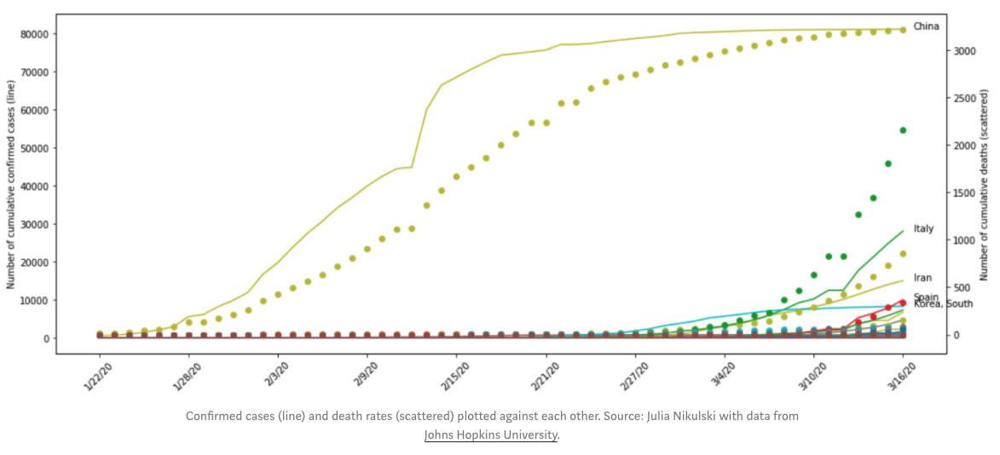

# COVID-19-Impacts
The political and economic perspective of COVID-19.

## How serious a threat is COVID-19?
It is without a doubt a serious threat to the entire world population. We must act today or many people will die and health care systems across the globe will collapse. The growth of new cases is exponential and has been exploding in some countries such as Italy, Iran, South Korea and China. However, the United States, Germany, France, Spain and other countries are only a few days behind the developments of more strongly affected countries.
Until March 16th, there were more confirmed cases in China than in all other countries combined. However, China’s complete shutdown of public life has helped to flatten the growth rate. And many other countries across all continents are adopting now similar restrictions on its citizens.

