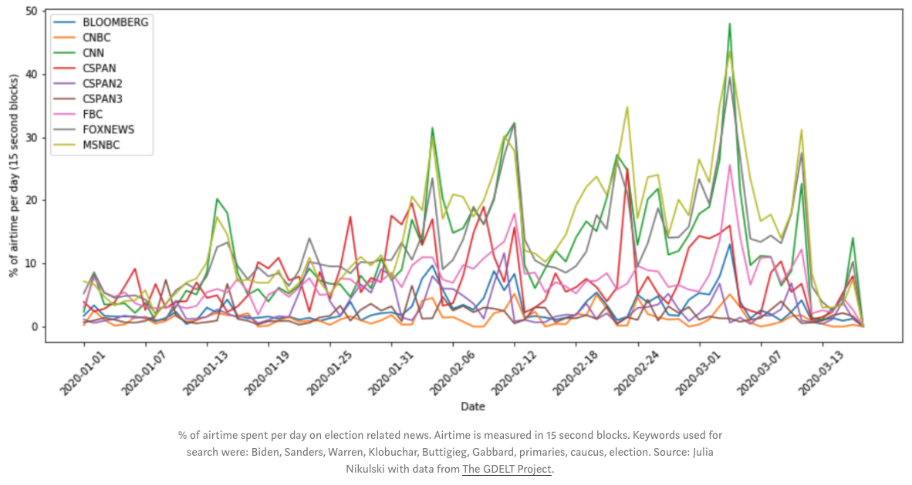

# COVID-19-Impacts
Investigating the news and economic perspective of COVID-19.

## How to run the code
The code requires Python versions of 3.* and general libraries available through the Anaconda package. Please check the covid-19.ipynb.

## Data
The data used for the analysis comes from:

* Financial data: [Yahoo Finance](https://finance.yahoo.com/)
* Coronavirus cases: [Johns Hopkins University](https://github.com/CSSEGISandData/COVID-19)
* News: [Media Cloud](https://explorer.mediacloud.org/#/Home) and [The GDELT Project](https://blog.gdeltproject.org/gdelt-2-0-television-api-debuts/)

## How serious a threat is COVID-19?
It is without a doubt a serious threat to the entire world population. We must act today or many people will die and health care systems across the globe will collapse. The growth of new cases is exponential and has been exploding in some countries such as Italy, Iran, South Korea and China. However, the United States, Germany, France, Spain and other countries are only a few days behind the developments of more strongly affected countries.
Until March 16th, there were more confirmed cases in China than in all other countries combined. However, China’s complete shutdown of public life has helped to flatten the growth rate. And many other countries across all continents are adopting now similar restrictions on its citizens.

Italy is the country with the second highest number of cases and the growth is still exponential, followed by Iran, Spain, South Korea, and Germany. This graph also shows the difficulties that the Italian health care system has had in dealing with the COVID-19 outbreak. And it is a precursor for other countries that are on the same trajectory as Italy, only a few days behind.

## What is being talked about in the news?
It has been virtually impossible to miss that there is currently a pandemic going on. And all the updates about COVID-19 have been drowning out anything else that is not related to the pandemic. 

TV news shifted in the same way from covering election related topics (caucuses, primaries, Democratic presidential contenders etc.) with almost 50% of airtime to an increase in coverage of the coronavirus. As of last week, the three major cable news channels (CNN, MSNBC, FOX NEWS) spent close to 20% of their airtime on the virus outbreak.

Interestingly, FOX News is spending the most time out of all news channels on discussing the outbreak. And unlike the other outlets, FOX News has been far less critical of Trump’s approach to COVID-19. The coverage there may significantly contribute to how Americans of different parties view the threat of the coronavirus (more on this below).

## How is the economy reacting?

Not well, to say the least. Compared with the economic recessions and stock losses over the past 35 years, the S&P 500, NASDAQ, Dow Jones, DAX and Hang Seng Index are just at the beginning of a bear market.

In terms of the biggest daily losses and gains over the past 35 years for the S&P 500, March 16th, 2020, is second only to Black Monday in 1987. Its third most devastating day was March 12th, 2020. However, because of the uncertainty of and daily updates to the current situation, the losses were almost completely regained the next day, making March 13th, 2020, the day with the third highest gains. What’s even more important: all other dates both on the losses and gains side of the table are amid significant economic downturns, indicating that we might be heading into a longer recession as well.
 
Looking more closely at the development over the past 3 months, the overall downward trend for all of these indices starting mid February becomes clear. When plotting the number of confirmed cases and index prices, there is a clear negative correlation.
China’s large numbers in confirmed cases are overshadowing the development of cases in other countries. After mid February, China managed to flatten its curve. But around that time the S&P 500 and the DAX started their downward path.

Excluding China shows that in mid February, the cases in South Korea started to rise as well as news about the quarantined cruise ships (the purple, horizontal line emerging at the very bottom of the graph after February 15th) got more and more attention.

There is a great article on the development of the Dow Jones Index in MarketWatch which shows how long the recovery of the index took after the economy went into recession. Currently, we are still at the beginning of a bear market, so we don’t know when the stock market will turn around and how long it’ll take to regain losses. But regulators assume the downward trend will continue for weeks.

The Fed cut its rate to close to 0 % on Sunday evening in an attempt to calm investors. However, investors didn’t take this as a sign of confidence. Trading halted at the New York Stock Exchange the next day right after the opening because the S&P 500 fell more than 7%.

## Concolusion:
* News: the topics discussed on TV news channels and in digital outlets and newspapers in the United States have shifted from heavily covering the Democratic presidential primary election to covering the coronavirus outbreak. Particularly Trump's handling of the situation has come under scrutiny and is heavily debated.
* Economy: stocks have entered a bear market and continue to drop. Looking at the past 35 years, the S&P 500 had its second and third worst days on March 16th and March 12th of this year (only Black Monday in 1987 was worse). The data as well as economists suggest that we are headed into a recession, the dimensions of which are yet to be seen.
